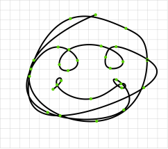

## Spline Solver
A n-dimensional spline library that supports cubic and quintic splines and ensures C^2 and C^4 continuity respectively.

### Paper
I wrote a small paper to show the derivations. You can find it [here](https://janhuenermann.com/paper/spline2020.pdf).

### Running the example
Requirements include Eigen, OpenCV, and C++17.
```bash
cmake .
make
./example
```
