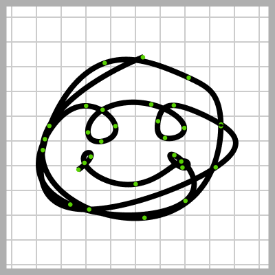

# Spline Solver

A spline library that implements arbitrary hermite splines with as many dimensions as you can dream of, and includes solvers for cubic and quinitic hermite splines that ensure C^2 and C^4 continuity. It's written in C++, uses Eigen for fast matrix computations and includes a infancy demo.

### Paper
I wrote a small paper to show the derivations I used for the quintic hermite spline solver. It includes some nice visualisations. You can find it [here](https://janhuenermann.com/paper/spline2020.pdf).

### Running the example
Requirements include Eigen, OpenCV, and C++17.
```bash
cmake .
make
./example
```

### Why I built this
As I worked on a robot project and read more about splines, I decided to write this little library including a demo to help make splines - a very helpful but abstract numerical math thing - more tangible. I hope, together with the derivations to contribute to the general understanding of splines, especially of the more unexplored quinitc hermite spline. 
